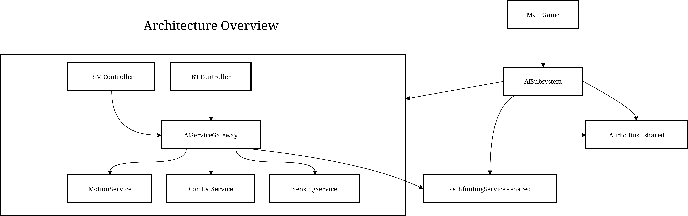
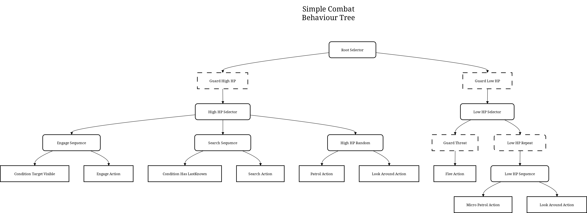
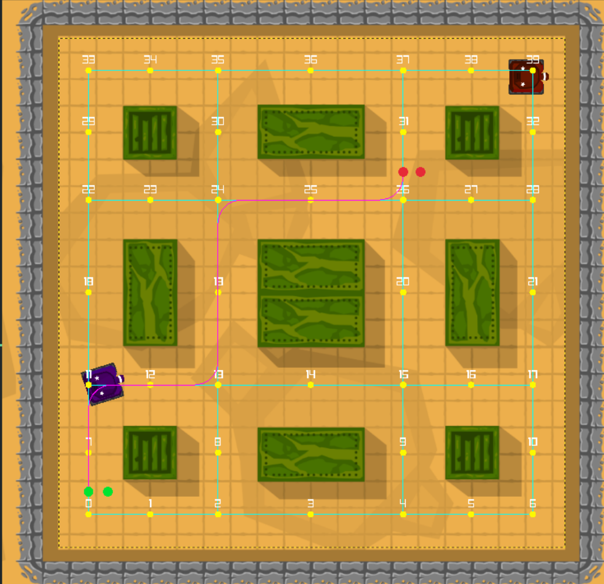
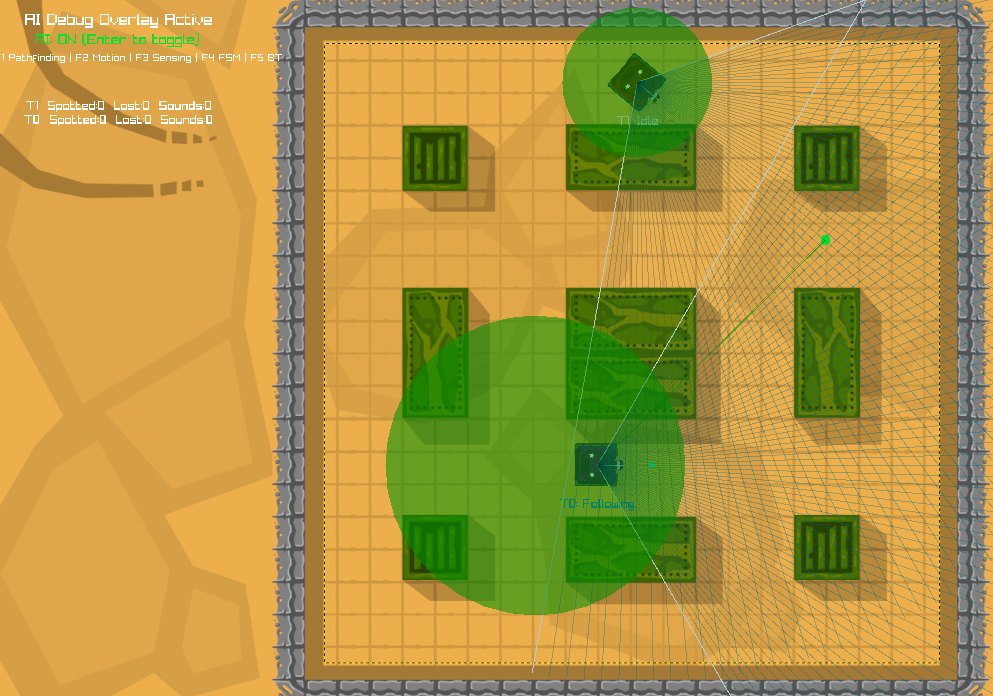
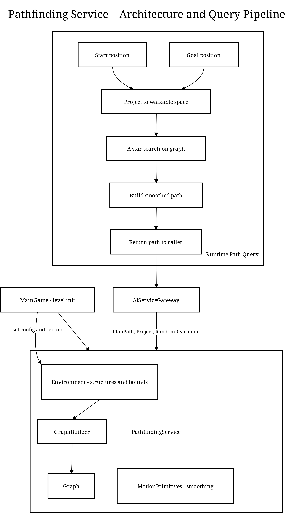
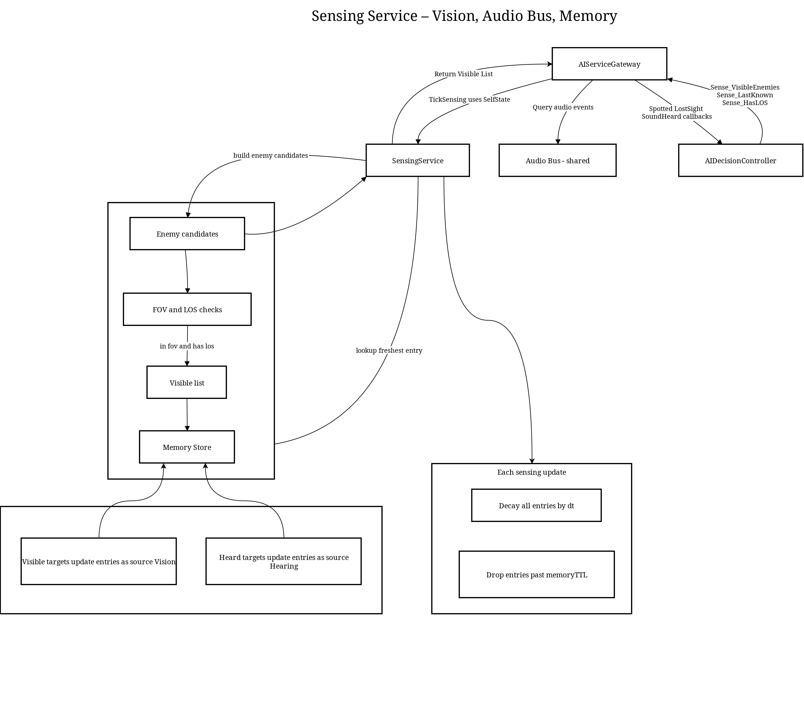

# TankAI - Decision-Making & Debugging Tech Sample (C++, Raylib)

Curated technical snapshot from my TankAI assessment project: a 1v1 top-down tank game used to explore **game-AI decision making** and **debuggable, modular architecture** in C++.

The original game framework (rendering + core tank physics) was provided; the AI system and its supporting services are the focus of this implementation.

- **Tech stack:** C++17, CMake, Raylib (cross-platform)
- **Core concepts:**
  - Dual AI brains: **Finite State Machine (FSM)** and **Behavior Tree (BT)**
  - Shared **service-gateway architecture** (Sense → Think → Act)
  - Modular services for pathfinding, motion, sensing, and combat
  - Extensive real-time debug overlays for both AI paradigms
  - **Compatibility focus:** both controllers run against the *same* world API + tick order + debug tooling

---

## Features

- **Two AI Architectures, One Foundation**
  - **FSM Controller:** explicit states + transitions (`Patrol`, `Engage`, `Flee`, etc.)
  - **Behavior Tree Controller:** composable nodes (`Selector`, `Sequence`, `Guard`, custom actions)
  - Both consume the **same `AIServiceGateway` API**, proving the architecture supports multiple decision paradigms without rewrites.

- **Modular Service Layer**
  - Pathfinding, motion, sensing, and combat are implemented as decoupled services.
  - Controllers express *intent* through the gateway; services execute it.

- **Sense-Think-Act Loop**
  - Clean per-frame pipeline ensuring decisions always use the latest world state.

- **Debug-First Development**
  - Rich overlays for navigation graphs, sensor state, motion goals, FSM states, and active BT paths.

---

## Architecture Overview

<div align="center">
  
  <br/>
  <em>High-level Sense → Think → Act data flow through gateway + services.</em>
</div>

The AI is structured around strict separation of concerns:

1) **`AISubsystem`** – central orchestrator  
   Owns agents/services and drives the AI tick.

2) **`AIServiceGateway`** – facade for controllers  
   Exposes world **queries** (e.g., `Sense_VisibleEnemies()`) and **intents** (e.g., `MoveTo()`, `BeginFire()`), hiding service internals.

3) **Services** – decoupled execution modules  
   - `PathfindingService`
   - `MotionService`
   - `SensingService`
   - `CombatService`

4) **AI Controllers** – decision makers  
   - `FSMController`
   - `BehaviorTreeController`

**Per-frame flow:**
- **Sense:** `SensingService` gathers/updates world knowledge + events.  
- **Think:** active controller processes events + queries gateway.  
- **Act:** `MotionService` / `CombatService` execute intents.

---

## AI Controllers

The project includes two distinct AI implementations that use the exact same `AIServiceGateway` API, demonstrating how different decision paradigms can be built on the same architectural foundation.

### Finite State Machine (FSM)
A deterministic, state-driven model.
- **States:** `Idle`, `Patrol`, `LookAround`, `Engage`, `Search`, `Flee`
- **Transitions:** event-based (`onSpotted`) + logic-based (target lost → `Search`)
- **Profile:** predictable, rigid, easy to reason about.

### Behavior Tree (BT)
A hierarchical model where behavior emerges from composition.

<div align="center">
  
  <br/>
  <em>BT structure illustrating priority and conditional guards.</em>
</div>

- **Nodes:** `Selector`, `Sequence`, `Guard`, `Action`
- **Structure encodes priority:** defensive/low-HP behavior evaluated before engagement.
- **Profile:** nuanced tactics, distinct low-health mode, less rigid patrol variety.

**Compatibility note:** both FSM and BT are runtime-interchangeable because they share identical service APIs, events, and tick order.

---

## Debugging

<div align="center">
  
  
  <br/>
  <em>Pathfinding and Sensing debug overlay layers</em>
</div>

Debug overlays are compiled only in debug builds and have no release-build cost.

- **Enter** – toggle AI globally  
- **F1** – Pathfinding (nav graph, obstacles, planned path)  
- **F2** – Motion (goals, lookahead, arrival radius, stuck info)  
- **F3** – Sensing (FOV/LOS + last-known memory)  
- **F4** – FSM (current state per agent)  
- **F5** – BT (active branch + running leaf node)

---

## Core Services (high-level)

### Pathfinding Service
Fast, modular path queries for tanks.

<div align="center">
  
  <br/>
  <em>Graph build → A* search → path output consumed by motion.</em>
</div>

- **GraphBuilder** builds a centerline nav graph
- Stateless **A\*** search
- Dynamic attachment for start/goal nodes

### Motion Service
Consumes paths and steers tanks smoothly.
- Pure-pursuit-style `PathFollower`
- Arrival + stuck detection events

### Sensing Service
Vision, hearing, and short-term memory.

<div align="center">
  
  <br/>
  <em>FOV/LOS + audio events + decaying memory store.</em>
</div>

- FOV + LOS checks
- Global audio bus for sound propagation
- Decaying last-known enemy positions

### Combat Service
Manages weapon charge → fire lifecycle.
- Tracks charge state, fires on release
- Emits sound events to sensing on fire

> More internal diagrams (Audio Bus, Combat Service, Motion Service) are available in `Docs/`.

---

## Building & Running

```bash
mkdir build
cd build
cmake ..
cmake --build .
```
Run the binary from the bin/ folder inside your build directory.

